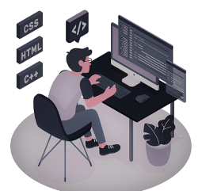

    

- <h2>👋 Hi there, I’m Marko</h2>
- 👀 I’m interested in <b>WebDesign and Networking</b>...
- 🌱 I’m currently learning React.js, I am learning as much as I can about WebDesign and about Networking...
- 💞️ I’m looking to collaborate on ...
- 📫 How to reach me<h5>markobegdev@gmail.com</h5>

My website take a look into it: 

## Languages and Tools:

<i>Good tools for WebDev:</i>
 
**Frontend Mentor**
 
<b>Style Stage</b>
 
**Frontend Practice**
 
<b>Free CSS</b>
 
and of course YouTube, stackoverflow.

<h3>Connect with me:</h3>

<!---
MarkoPolo125/MarkoPolo125 is a ✨ special ✨ repository because its `README.md` (this file) appears on your GitHub profile.
You can click the Preview link to take a look at your changes.
--->

